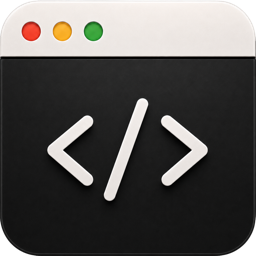
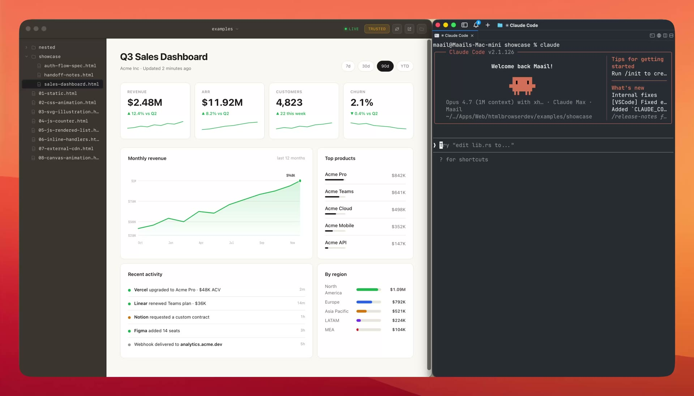
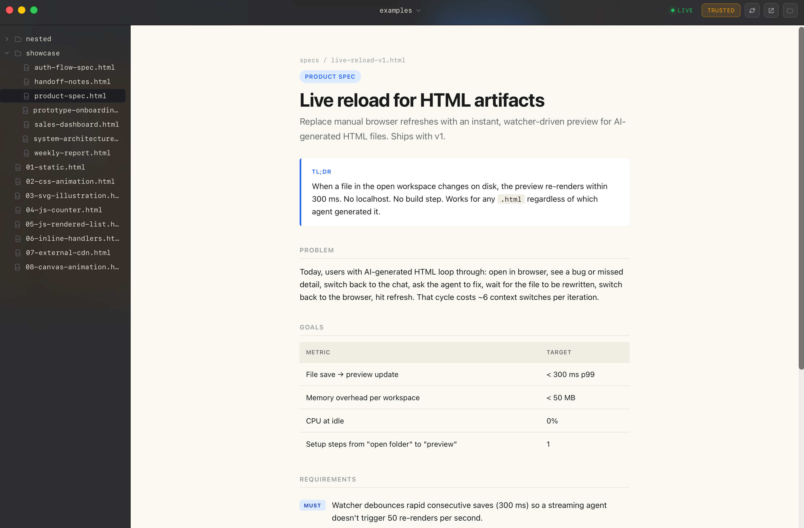
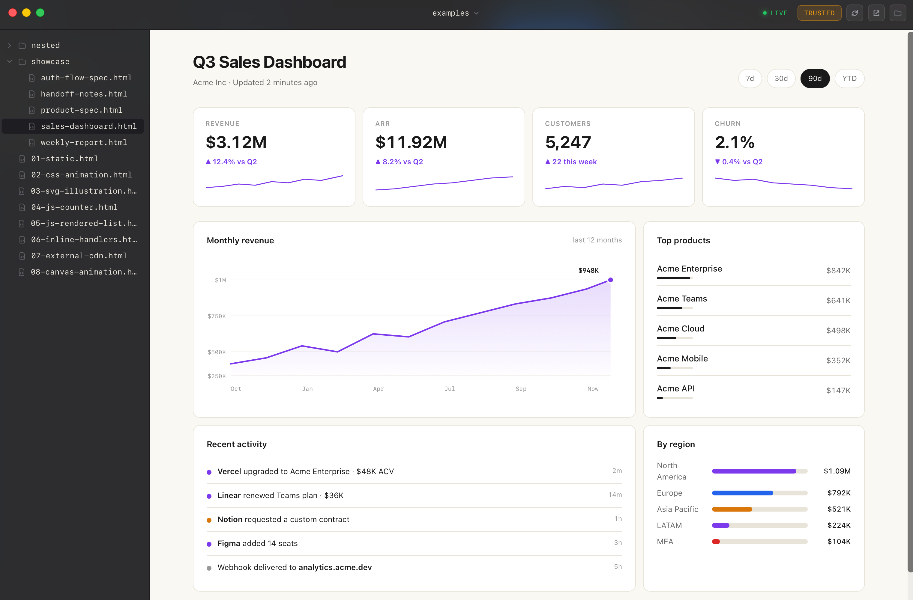
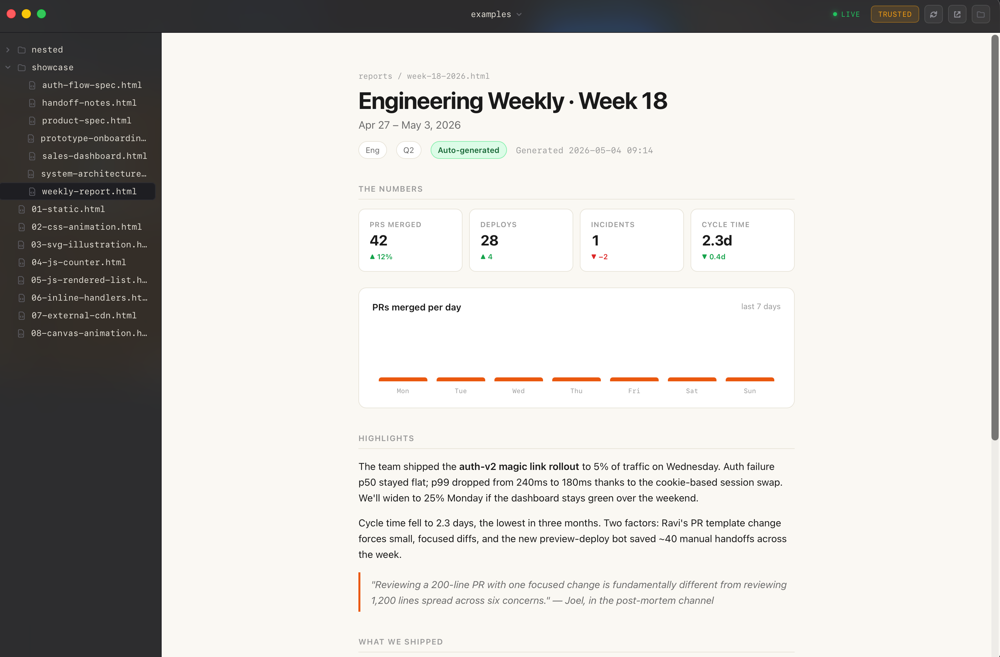
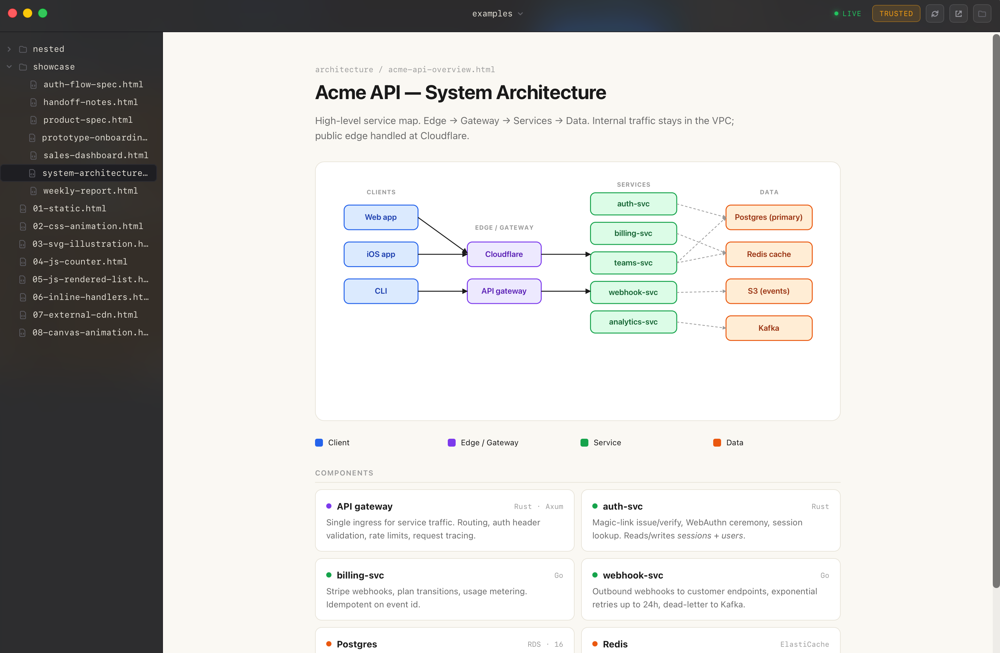
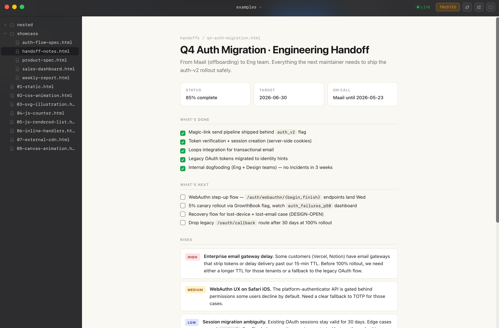
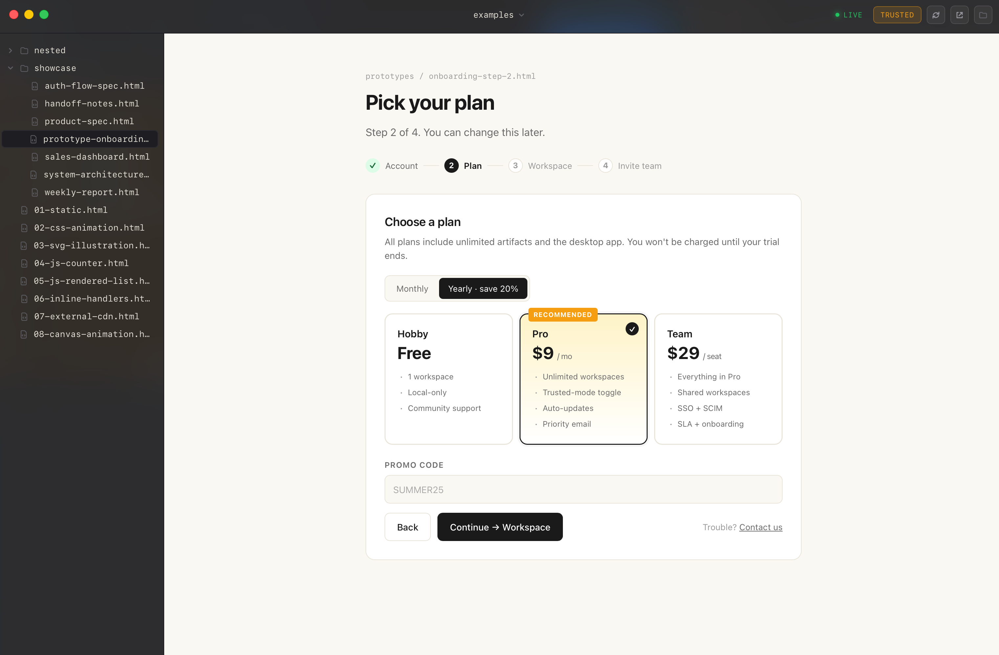

<div align="center">



# HTML Browser

A local-first viewer for AI-generated HTML artifacts.

[](#install)
[](https://tauri.app)
[](./LICENSE)
[](https://github.com/maail/htmlbrowser.dev/releases/latest)

[**↓ Download for macOS**](https://github.com/maail/htmlbrowser.dev/releases/latest/download/htmlbrowser.dev.dmg) · [Website](https://htmlbrowser.dev) · [Releases](https://github.com/maail/htmlbrowser.dev/releases)

</div>

<br />



<br />

Claude Code, Cursor, OpenCode, and other AI workflows constantly generate HTML files — specs, dashboards, reports, prototypes, handoffs. Browsers aren't built for this. **HTML Browser** is.

Open a folder. Get instant previews with live reload. No browser tabs. No localhost servers. No clutter. Built with Tauri v2, React, Zustand, and Rust. The app keeps everything on disk, watches for changes via `notify`, isolates each artifact in a dedicated child webview with a custom `htmlartifact://` URI scheme, and ships with a signed + notarized macOS release flow.

It is **not** a browser replacement. It is a runtime for local artifacts.

## Demo

> Watch the [demo video](https://htmlbrowser.dev/demo.mp4) for the live-reload flow.

<br />

## Install

```bash
# Direct download (signed, notarized, Apple Silicon + Intel universal)
https://github.com/maail/htmlbrowser.dev/releases/latest/download/htmlbrowser.dev.dmg
```

Or grab the latest signed and notarized DMG from the [Releases](https://github.com/maail/htmlbrowser.dev/releases) page.

Auto-updates on launch — when a new release ships, the app prompts you to install it.

## Designed for generated artifacts

<table>
<tr>
<td width="33%"><div align="center"><b>Specs</b></div></td>
<td width="33%"><div align="center"><b>Dashboards</b></div></td>
<td width="33%"><div align="center"><b>Reports</b></div></td>
</tr>
<tr>
<td width="33%"><div align="center"><b>Architecture</b></div></td>
<td width="33%"><div align="center"><b>Handoffs</b></div></td>
<td width="33%"><div align="center"><b>Prototypes</b></div></td>
</tr>
</table>

## Features

- Open any local folder as a workspace; switch between recents from the title-bar dropdown
- Sidebar file explorer for `.html` / `.htm` files, recursive with auto-skip for heavy directories (`node_modules`, `target`, `.git`, etc.)
- Dedicated child webview for isolated preview rendering — no iframes
- **Live reload** when files change on disk (`notify`-driven, 300ms debounce)
- Custom `htmlartifact://` URI scheme with per-mode CSP
  - **Safe**: no JS, no network, no remote assets
  - **Trusted**: opt-in, persisted per workspace
- One-click banner prompt when Safe mode blocks JavaScript
- Workspace persistence, last-opened restore, per-workspace trust mode
- Native macOS menu: **Check for Updates**, Open Folder (⌘O), Reload Preview (⌘R)
- Auto-updater (Tauri ed25519-signed) over GitHub Releases
- Dark mode, sidebar vibrancy, traffic-light positioning, signed + notarized

## Stack

- [Tauri v2](https://tauri.app) — desktop runtime
- React 19 + TypeScript + Vite — frontend
- TailwindCSS — styling
- Zustand — state management
- Rust — `notify` for file watching, custom URI scheme protocol for sandboxed file delivery, ed25519 (`rsign`) for updater signing

## Requirements

For users:

- macOS 11+ (universal binary — Apple Silicon + Intel)

For development:

- Node 20+
- pnpm 10+
- Rust (stable)

## Development

```bash
pnpm install
pnpm tauri:dev
```

The app launches in dev mode with hot-reload for the React frontend and incremental Rust rebuilds when `src-tauri/` changes.

### Smoke test

```bash
pnpm tauri:dev
# In the app: Open Folder → ./examples/
```

The `examples/` folder contains baseline-test fixtures (`01-static.html` through `08-canvas-animation.html`) covering each rendering path. `examples/showcase/` has six polished demo files for stress-testing AI-generated artifacts (dashboards, specs, reports, handoffs, architecture diagrams, interactive prototypes).

## Releasing

Tag-driven via GitHub Actions. See [RELEASE.md](./RELEASE.md) for the one-time signing-asset setup; subsequent releases:

```bash
scripts/bump-version.sh patch    # or minor / major / x.y.z
git push origin main --follow-tags
```

The workflow builds a universal binary, signs with Developer ID, notarizes via Apple, signs the updater archive with the embedded ed25519 key, and publishes to GitHub Releases with a `latest.json` manifest. Existing installs auto-detect the new version on next launch.

## License

MIT — see [LICENSE](./LICENSE).
